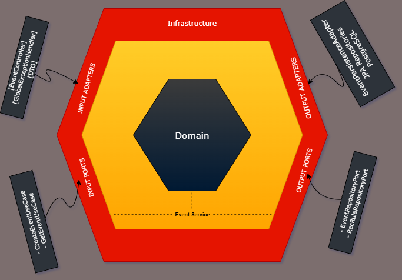

# 📅 Event Scheduler API (Spring Boot & PostgreSQL)

### 📌 Project Overview
This project is a RESTful API for managing and resolving event schedule conflicts, now fully refactored from a traditional Layered Architecture to a clean **Hexagonal (Ports & Adapters) Architecture**.

This modern design decouples the core business logic (`domain`) from all external infrastructure concerns (`adapters`), making the application highly **testable**, **maintainable**, and **flexible**.

The project is fully containerized and features a complete **CI/CD pipeline** using **GitHub Actions**, which automatically builds and verifies all code. This includes running a multi-layered test suite that validates the persistence adapter against a real, throwaway **Testcontainers** PostgreSQL database.

### 🏛️ Architecture: Hexagonal (Ports & Adapters)
At the core of this project is the **Dependency Inversion Principle**. The `domain` (business logic) is completely isolated and defines "ports" (interfaces) for its needs. The `adapters` (infrastructure) provide the implementations for these ports. The `domain` depends on nothing.

### ✨ Key Implemented Features

| Feature                   | Technical Focus                                                                                                                                                                                                                                                                                                                                                                       |
|---------------------------|---------------------------------------------------------------------------------------------------------------------------------------------------------------------------------------------------------------------------------------------------------------------------------------------------------------------------------------------------------------------------------------|
| Hexagonal Architecture    | **Domain** (`EventService`, models, ports) is pure, with no dependencies on Spring Web or Data. Adapters (`EventController`, `EventPersistenceAdapter`) handle all technology concerns.                                                                                                                                                                                               |
| Complex Domain Logic      | Core business rules (recurrence generation, conflict resolution) are isolated and unit-tested within the `EventService`, completely separate from the database.                                                                                                                                                                                                                       |
| Automated CI/CD Pipeline  | A **GitHub Actions** workflow automatically builds, tests, and verifies every push and pull request to the `main` branch, ensuring code quality.                                                                                                                                                                                                                                      |
| Production-Parity Testing | **Testcontainers** are used to run integration tests (`EventRepositoryTest`), validating all JPA queries and entity mappings against a **real, throwaway PostgreSQL container**.                                                                                                                                                                                                      |
| Comprehensive Test Suite  | The project features three distinct levels of automated testing: **1. Domain Unit Tests**: (e.g., `EventServiceTest`) Mocks ports to test pure business logic. **2. Adapter Unit Tests**: (e.g., `EventControllerTest`) Mocks use cases to test web layer logic. **3. Adapter Integration Tests**: (e.g., `EventRepositoryTest`) Runs against a real Testcontainers DB.   |
| Defensive Programming     | Implements **Java Bean Validation** (`@Valid`, `@NotNull`) in the `EventController` for first-layer request validation.                                                                                                                                                                                                                                                               |
| Global Exception Handling | `@RestControllerAdvice` translates pure domain exceptions (e.g., `ScheduleConflictException`) into clean, consistent HTTP 4xx error responses.                                                                                                                                                                                                                                        
| Containerized             | Fully configured with a `Dockerfile` and `docker-compose.yml` for easy local development and production deployment.                                                                                                                                                                                                                                                                   

### 🛠️ Tech Stack
- **Backend:** Spring Boot 3, Java 21, Lombok
- **Database:** PostgreSQL (Production), Spring Data JPA, H2 (Development)
- **Testing:** JUnit 5, Mockito, Spring MockMvc **Testcontainers**
- **CI/CD: GitHub Actions**, Docker, Docker Compose
- **Documentation:** Springdoc OpenAPI (Swagger UI)

### 🚀 Getting Started (H2 Development Mode)
You can run this application in two ways:

**Option 1: H2 Development Mode (Quick Start)**

The default `dev` profile uses an in-memory H2 database and is pre-loaded with demo data.

1. Run the application from your IDE (`Application.java`).
2. Access the Swagger UI at http://localhost:8080/swagger-ui.html.

**Option 2: Docker Compose (Production-like)**

This method runs the application against a real PostgreSQL database, just like in production.

1. Make sure you have Docker Desktop running.
2. Create a `.env` file in the root directory from the `.env.example`.
3. Run the command:
`docker-compose up -d
`
4. The API will be available at http://localhost:8080.

### 💡 Future Enhancements
- Extend update logic to handle mass updates of recurring series (e.g., "Update this and all future events").
- Add a new Event-Driven Adapter (e.g., a Kafka producer) to publish an event when a new schedule is confirmed.
