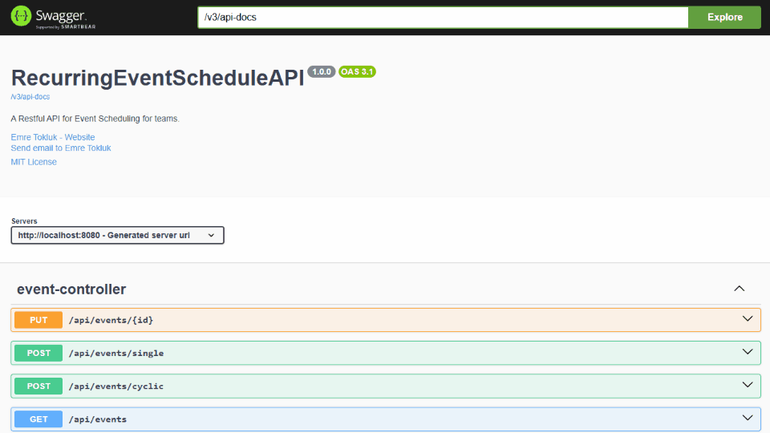

# 📅 Event Scheduler API (Spring Boot & PostgreSQL)

### 📌 Project Overview
This project is a RESTful API designed to manage and resolve conflicts for single and recurring (cyclic) events. It demonstrates strong proficiency in clean layered architecture (Controller, Service, Repository), implementing complex algorithmic business logic, and preparing the application for containerized deployment.

This solution was inspired by a common backend interview question focused on scheduling and data integrity.

### ✨ Key Implemented Features

| Feature                   | Technical Focus                                                                                                                                                                                        |
|---------------------------|--------------------------------------------------------------------------------------------------------------------------------------------------------------------------------------------------------|
| Recurrence Engine         | Generates multiple concrete Event occurrences based on a single RecurrenceRule (e.g., "Every Monday until DATE/FOREVER").                                                                              |
| Conflict Resolution       | Implements scheduling checks to prevent overlapping time ranges during both event creation and update operations (HTTP 409 Conflict).                                                                  |
| Atomic Updates            | Handles updating a single event while correctly excluding its own time slot from the conflict check to avoid false positives.                                                                          |
| Global Exception Handling | Centralized error management using `@RestControllerAdvice` to map custom exceptions (`ScheduleConflictException`, `ResourceNotFoundException`) to clean, consistent HTTP status codes (409, 404, 400). |
| Testing                   | Comprehensive JUnit 5 and Mockito unit testing of the Service layer logic, ensuring the recurrence and conflict resolution algorithms are validated.                                                   |
| Infrastructure Readiness  | Configured for rapid deployment using Docker and PostgreSQL persistence (pending final implementation).                                                                                                |

### 🛠️ Tech Stack
- **Backend:** Spring Boot 3, Java 21, Lombok
- **Database:** PostgreSQL (Target), Spring Data JPA, H2 (Development)
- **Testing:** JUnit 5, Mockito, Spring MockMvc
- **Documentation:** Springdoc OpenAPI (Swagger UI)
- **CI/CD:** Docker, Docker Compose

### 🚀 Getting Started (H2 Development Mode)
The application starts in H2 mode by default, which is sufficient for viewing sample data and testing API functions immediately.

#### 1. Run the Application
Start the application from your IDE (`Run Application.java`).

#### 2. Access Documentation
The interactive documentation allows immediate testing of all endpoints:  
**Swagger UI:** [http://localhost:8080/swagger-ui.html](http://localhost:8080/swagger-ui.html)

#### 3. Test Query Example
The system is pre-loaded with sample recurring events. To test the recurrence engine, query the `/api/events` endpoint with a future date (e.g., try querying next Monday).

### 💡 Future Enhancements
- Implement full Docker Compose setup for PostgreSQL persistence.
- Extend update logic to handle mass updates of recurring series (e.g., "Update this and all future events").
- Implement event deletion (single or series).  
